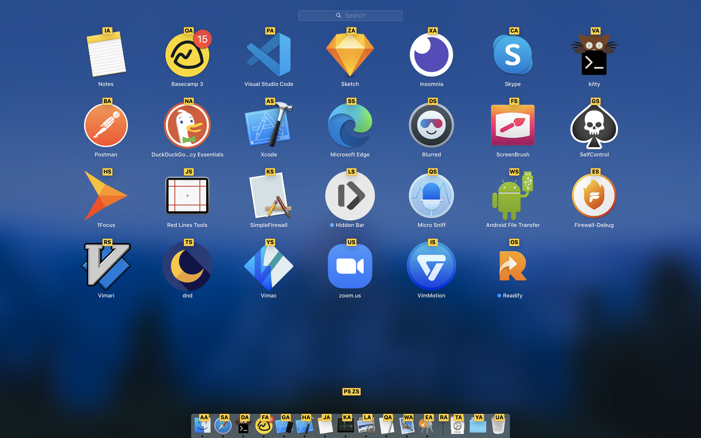
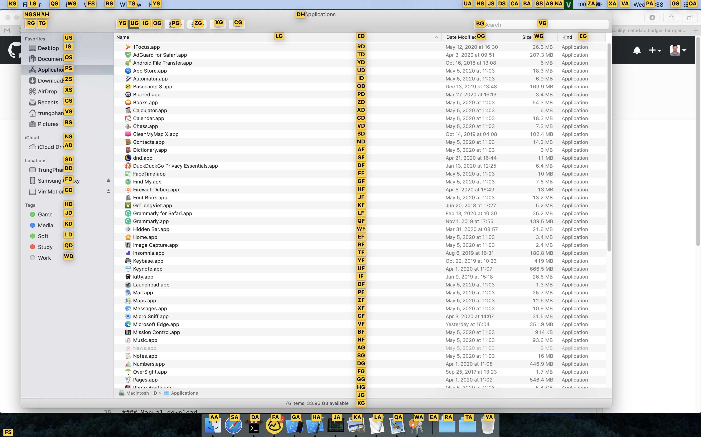
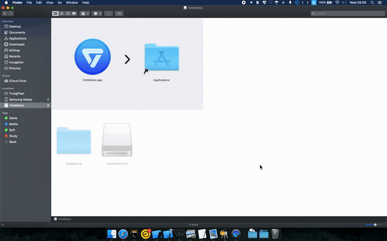
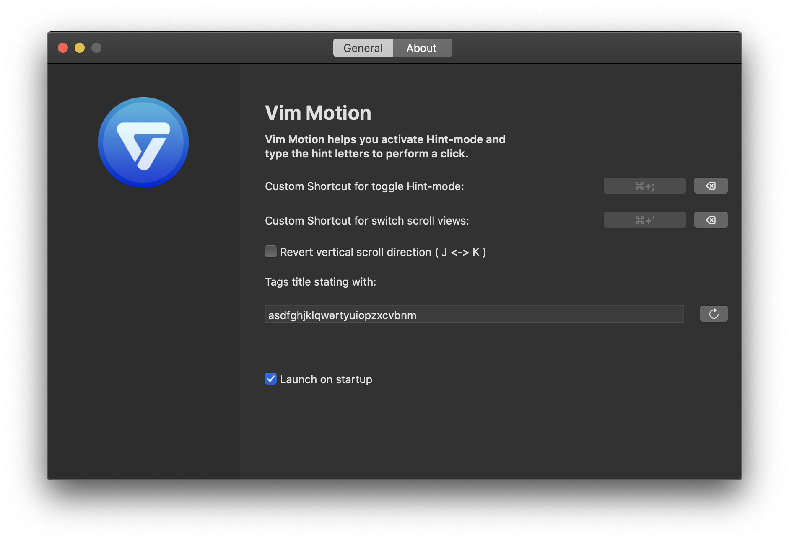
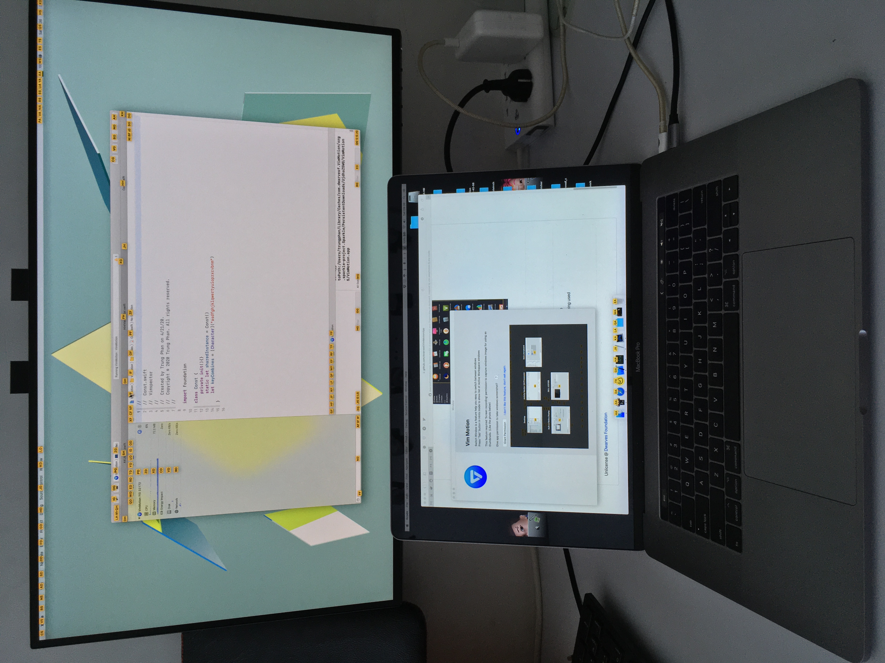
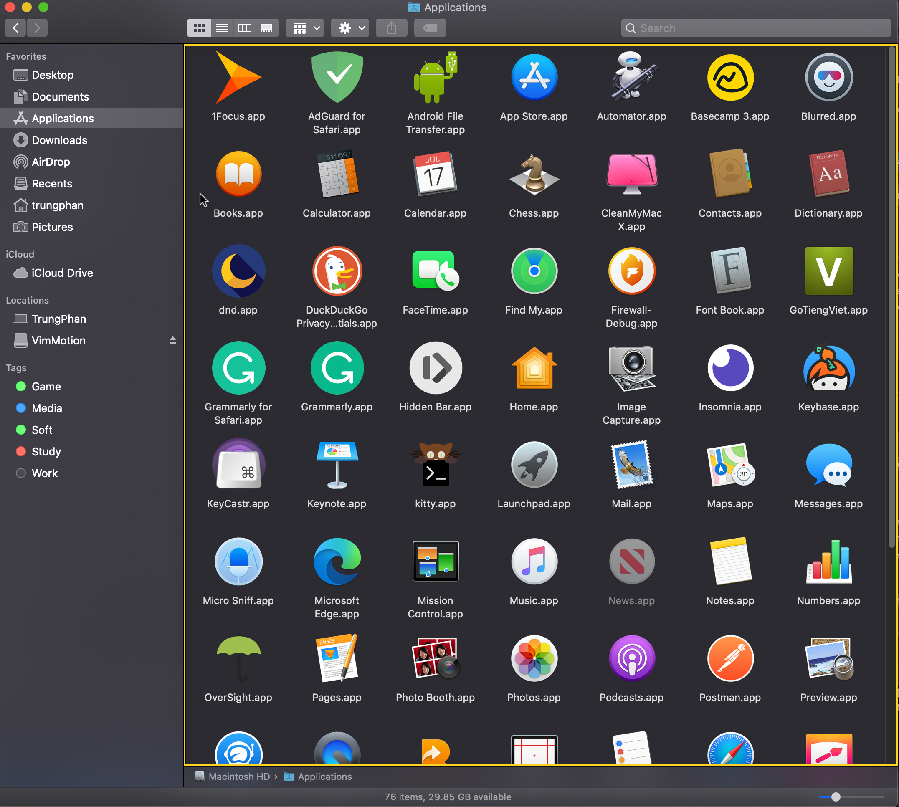

<p align="center">
	
</p>
<p align="center">
	<a href="https://webuild.community">
        	
	</a>
	<a href="https://github.com/dwarvesf/VimMotionApp/releases/latest">
 		
	<a href="https://img.shields.io/badge/platform-macOS-lightgrey.svg">
 		
	</a>
</p>

## VimMotion

We are bringing vim-easymotion to macOS , where most UI elements can be accessed with your fingers stay on the keyboard. Hope vim users enjoy it as much as we do ♥️

Along with the favorite Vimari ext on Safari or Vimium on Chrome, vim users will gain a new power.

<p align="center">
	
	
</p>


## 🚀 Install

#### Using Homebrew

```Shell
$ brew tap dwarvesf/homebrew-tap
$ brew install --cask vimmotion
```

#### Manual download

- [Download latest version](https://github.com/dwarvesf/VimMotionApp/releases/latest)
- Open and drag the app to the Applications folder.

## 🕹 Usage
# Hint mode.

* `⌘ + ;` To show tags on UI.
* Type Tag title to filter and trigger action, `Delete` if you want to refilter tags.
* `esc`, `⌘ + w` or  `⌘ + ;` To dismiss tags.
* `Spacebar` to temporary hide tags for 0.75s. This helping you see contents under tags without dismiss and reopen Hint mode. 
* `Tab` to show Switch window mode, `Tab` again to hide it.(This feature required Screen Recording permission to capture windows image for using as thumbnails)
<p align="center">
	
</p>

Assign any Hotkey and Tags label, Revert J <-> K to scroll up - down if you want. 
<p align="center">
	
</p>

Easy to switch windows of Active workspace with `Tab` in Hint mode.
<p align="center">
	
</p>

Multiple monitor supported.
<p align="center">
	
</p>


# Scroll mode
* `⌘ + '` To show scroll mode on UI.
* `esc`, `⌘ + w` or  `⌘ + ;` To dismiss scroll mode.
* `Tab` or `Shift + Tab` to navigate between Scroll area
* `HJKL` to scroll, you can go to Preferences window to revert J <-> K.
<p align="center">
	
</p>


## Requirements
macOS version >= 10.13

## You may also like
- [Blurred](https://github.com/dwarvesf/Blurred) - A macOS utility that helps reduce distraction by dimming your inactive noise
- [Micro Sniff](https://github.com/dwarvesf/micro-sniff) - An ultra-light macOS utility that notify whenever your micro-device is being used
- [Hidden](https://github.com/dwarvesf/hidden) - An ultra-light MacOS utility that helps hide menu bar icons

## License

Unlicense @ [Dwarves Foundation](https://github.com/dwarvesf)

